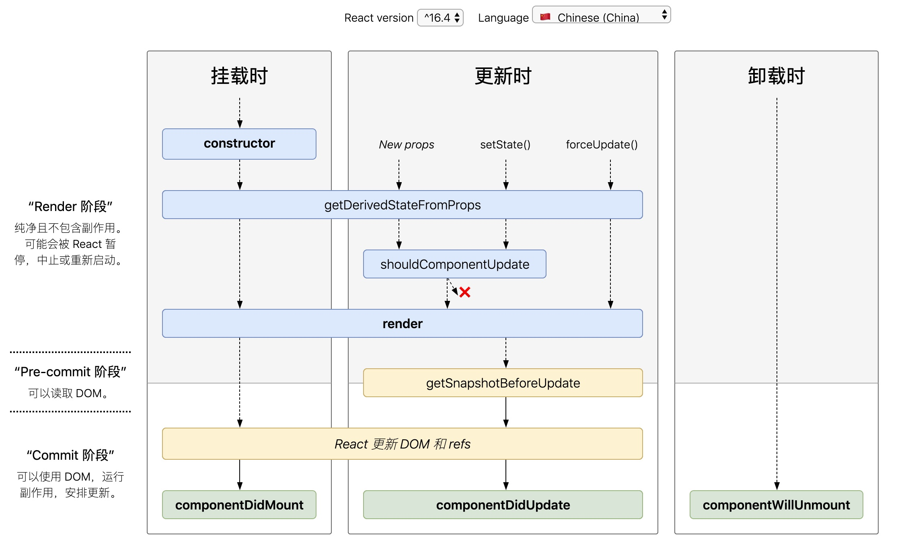

# 这节我们来聊聊 16.8 之后的生命周期

### 即将过气的生命的周期

> componentWillMount()
> componentWillReceiveProps()
> componentWillUpdate()
> 官方计划在 17 版本完全删除这三个函数，只保留 UNSAVE\_前缀的三个函数，目的是为了向下兼容，但是对于开发者而言应该尽量避免使用他们，而是使用新增的生命周期函数替代它们
> 目前 React 16.8 +的生命周期分为三个阶段,分别是挂载阶段、更新阶段、卸载阶段，以下是新的生命周期的介绍

### 新的生命周期图谱



### 新增的两个较为常用的生命周期

> 这里介绍一下新增的两个新增的生命周期
> static getDerivedStateFromProps(props, state)
> getSnapshotBeforeUpdate()

### 错误处理新增钩子

> static getDerivedStateFromError()
> componentDidCatch()

```js
```
